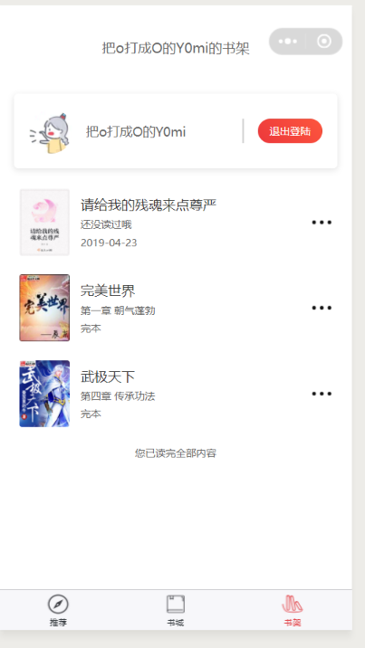
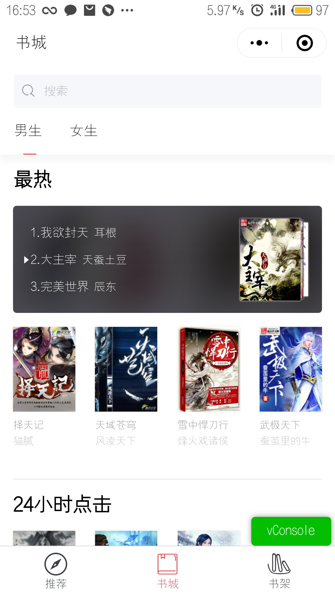
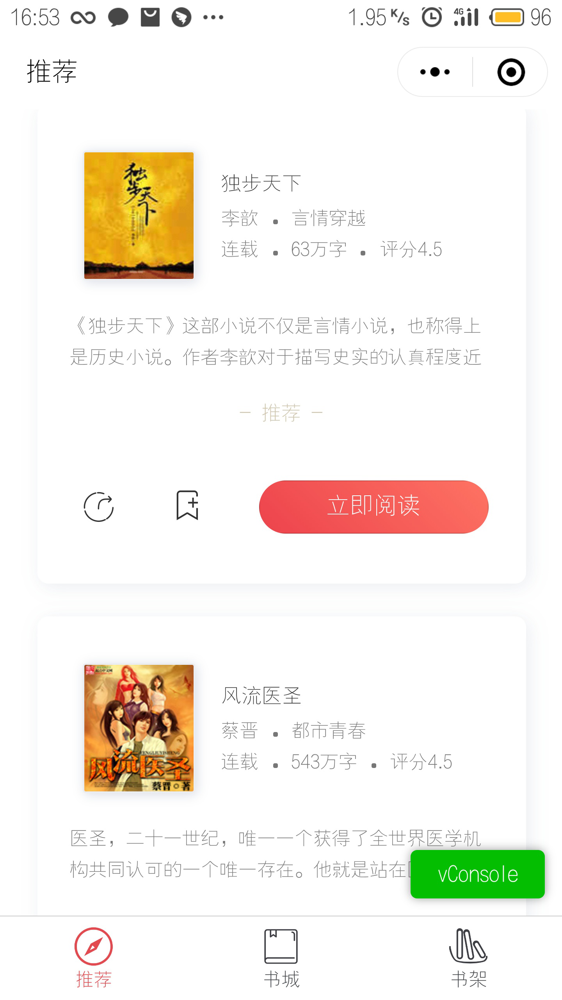
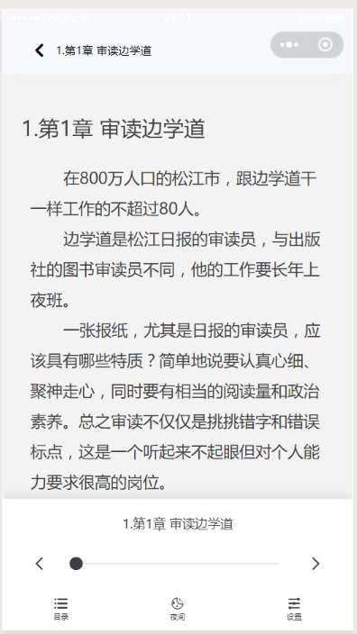
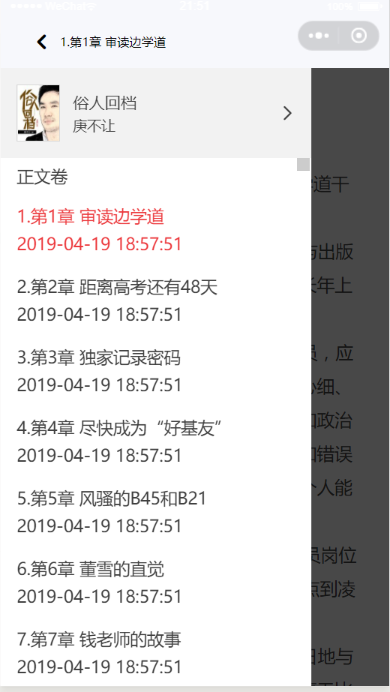
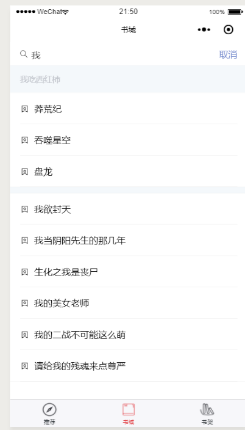
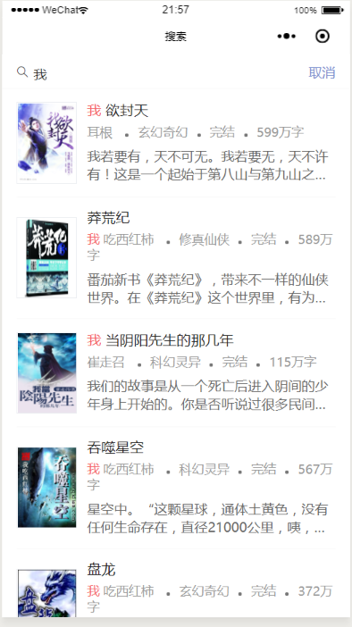
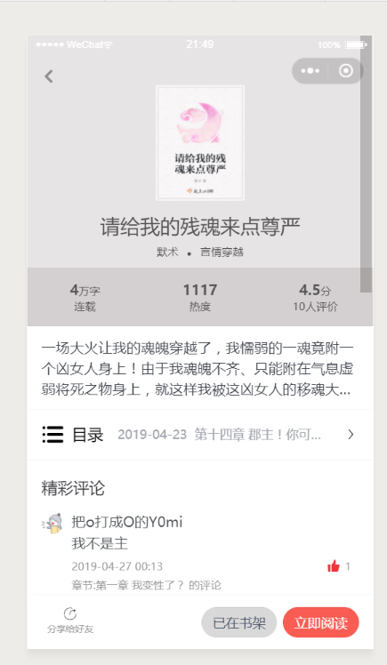

# YNovel

## 描述

这是一个用[Megalo](http://megalojs.org/)写的阅读小程序。


## 目录结构

```
src
├─app.js ---------------------------------------------------------------- 主入口
├─App.vue --------------------------------------------------------------- 根实例，其中全局数据
├─utils ----------------------------------------------------------------- 工具类和方法
├─static ---------------------------------------------------------------- 静态资源目录，小程序主体使用
|   ├─imgs -------------------------------------------------------------- 图片资源，包含tab图标
├─pages ----------------------------------------------------------------- 主要页面
|   ├─bookrack.vue ------------------------------------------------------ tab页-书架
|   ├─bookStore.vue ----------------------------------------------------- tab页-书城
|   ├─recommend.vue ----------------------------------------------------- tab页-推荐
|   ├─searchResult ------------------------------------------------------ 搜索结果页
|   ├─readPage ---------------------------------------------------------- 阅读页
|   ├─personalCenter ---------------------------------------------------- 个人中心页
|   ├─comment ----------------------------------------------------------- 评论页
|   ├─bookrack ---------------------------------------------------------- 书架页
|   ├─bookDetail -------------------------------------------------------- 书籍详情页
├─components ------------------------------------------------------------ 组件
├─assets ---------------------------------------------------------------- 资源目录
├─api ------------------------------------------------------------------- api接口
```


## 使用说明

1. UI使用。小程序使用了[vant-weapp](https://youzan.github.io/vant-weapp/#/quickstart)作为UI组件库，使用时需要将其源码克隆到构建出的【dist-wechat】目录，本人将`vant-weapp/dist`目录重命名为`vant`引入，即`dist-wechat/vant` = `vant-weapp/dist`

2. 运行

   微信小程序：

   ```bash
   npm run dev:wechat
   ```

   支付宝小程序：

   ```bash
   npm run dev:alipay
   ```

   百度智能小程序：

   ```bash
   npm run dev:swan
   ```


## 功能实现

1. 书架功能，保存最近阅读内容，订阅和取消功能。登录主要支持微信登录和手机验证码登录。

     

2. 书城功能，区分男女做不同标签的书籍的初步推荐。

      

3. 推荐功能，通过基于物品的协同过滤算法实现推荐。

      

4. 阅读   

       

5. 搜索

       

6. 书籍详情, 其中背景色和字体颜色是根据书籍主图的主色决定的,通过主色提取得到

      

